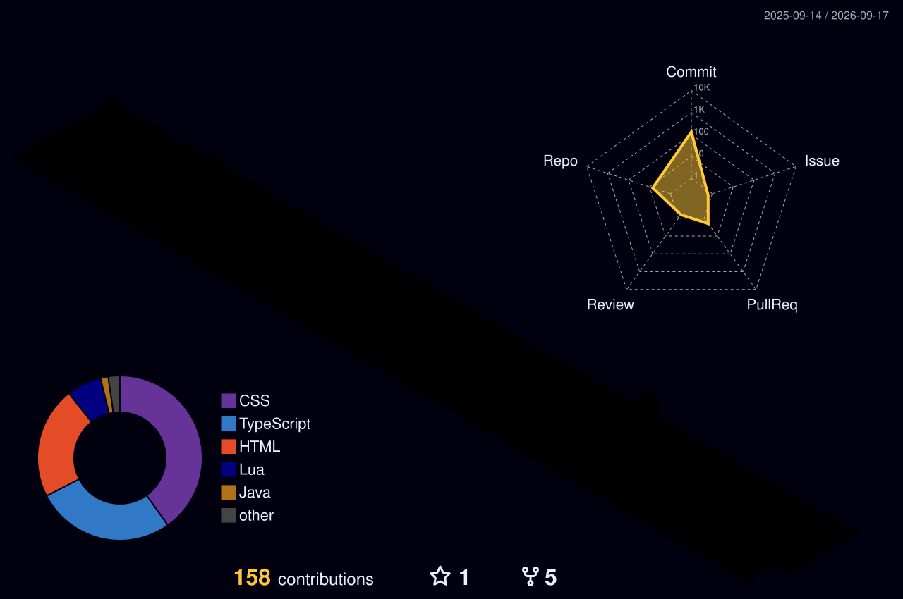

<h1 align="center">Olá, eu sou Matheus Wenes 👋</h1>

  

 

## Sobre mim 💬

- 🎓 Estudante do 7º semestre de Sistemas de Informação
- 🖥️ Focado em infraestrutura e suporte de TI
- 🤖 Explorando inteligência artificial e automação
- 🐍 Desenvolvendo projetos e scripts com Python
- 🐧 Experiência com ambientes Linux e Windows

### Interesses

- ✨ Infraestrutura, virtualização e containers
- ✨ Inteligência artificial e automação
- ✨ Tecnologia, games e música

 

## Linguagens e ferramentas 👨‍💻 🛠️

  
    
  
    
  

 

## Contato 🤝

  
  
  
  

 

## Contribuições 📊

  

